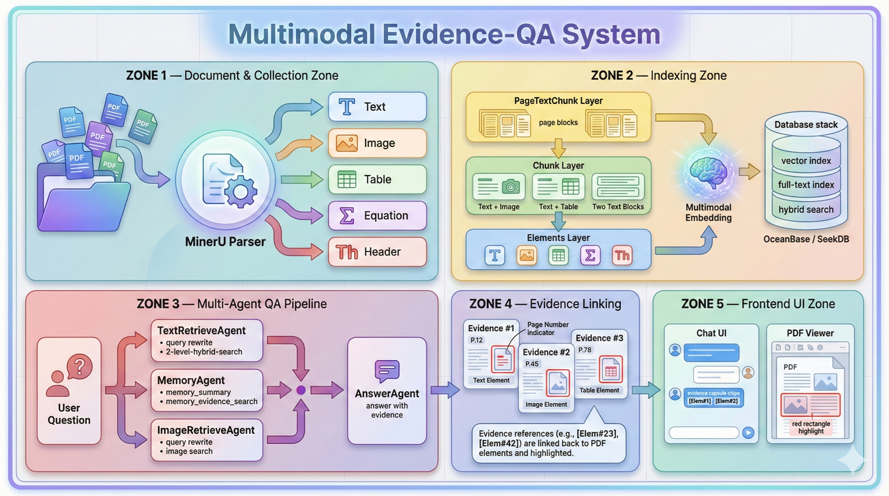

# SeekDB-paperQA-system

# 系统功能介绍

- 对论文/论文集合进行带evidence的多模态/多轮问答，答案中包含能跳转并高亮pdf对应区域的链接。
- 问答答案以用户友好的markdown形式渲染，支持在前端网页显示数学公式。
- 记录对论文/论文集合的问答历史。
- 对论文/论文集合中的文本块进行简单向量检索
- 从arxiv检索最新的论文，并加入问答系统

## 分页面功能简介
- 主页
	- 创建collection
	- 查看collection列表
	- 根据name和description搜索collection
- collection页面
	- 查看当前collection信息(名称、描述)
	- 查看当前collection中的document列表
	- 查看当前collection聊天历史列表
	- pdf论文(document)上传
	- 全文检索collection内相关论文(按title/abstract/论文全文)
	- 对collection内文本chunk的向量检索
	- 新建对当前collection的chat
- document页面
	- 查看document信息(标题、摘要、页数、切分产生的文件个数)
	- 对document内文本chunk的向量检索
	- 查看当前document的聊天历史列表
	- 新建对当前collection的chat
- chat历史
	- 显示collection聊天历史列表，可导航到对应的聊天页面或删除对应的聊天
	- 显示document聊天历史列表，可导航到对应的聊天页面或删除对应的聊天
- arxiv搜索
	- 根据关键词、标题、摘要、发布时间、作者检索arxiv中的最新论文
	- 展示检索出的arxiv论文列表
	- 点击卡片查看检索到的论文的分类、作者和摘要/ 跳转到对应的arXiv页面
	- 选定检索到的论文加入系统的arxiv收藏夹
- arxiv收藏夹
	- 按标题/摘要/作者检索收藏夹中已有的arxiv论文
	- 选定collection，将一个收藏夹中的arxiv论文添加到collection中，从而可以在问答系统中进行问答。

# 系统技术栈
后端：
- oceanbase/seekdb 数据库:
	- 全文检索/向量检索/混合检索引擎
	- 文档索引
	- 聊天历史、记忆存储
- dspy: agent实现+日志
	- 检索Agent
	- memoryAgent
- minerU: pdf解析为element
	- 3级分块索引建立： element-chunk-page
	- deploy locally with vllm in conda env
- fastapi:
	- 后端RESTFUL-api接口框架

前端：
- React with javascript

LLM:
- text-llm: openrouter "x-ai/grok-4.1-fast:free"
- vision-text-llm: openrouter   "x-ai/grok-4-fast"
- embedding: "jinaembeddingv4" deploy locally with vllm

# 开发工具
AI-assisted coding
后端架构设计和实现： openai codex-gpt5.1 + 人工
前端设计： figma make + 人工
前端实现： openai codex-gpt5.1 + 人工
前端浏览器: chrome

# 项目部署方式

## 仓库结构总览
- 根目录
  - `EviQAsys/backend/app`: FastAPI 应用入口 (`main.py`)，包含 `api` 路由、`repositories` 数据访问层、`schemas` Pydantic 模型，以及 `services` 下的 `qa_flow`、`retrieval`、`integrations`、`embedding`、`ingestion`、`index`、`llm/image`、`mapping`、`memory`、`parser`、`preprocess` 等服务模块。
  - `EviQAsys/backend/tests`: 手动测试脚本与仓储层验证样例。
  - `EviQAsys/frontend/src`: React 前端骨架，按 `api`、`components`（含 `layout`、`ui`）、`pages`（含 `image`）、`assets`、`config` 分层。
  - `dependency/`: MinerU、OceanBase、DsPy 与多模态 embedding 演示脚本及示例（参考实现，不随主线发布）。
  - `docs/`: 架构图与设计文档（如 `docs/image_asset/OBPaperQA.png`）。
  - `scripts/`: 辅助脚本与运维工具。
  - `model/`: 预置或导出的模型资源占位目录。
  - `sample_data/`: 真实样例数据挂载点（只读、不提交）。
  - `log/`、`debug/`: 日志与调试输出挂载点（不提交）。
  - 其他: `AGENTS.md`（贡献指南与约束）、`README.md`（项目说明）。

# 系统问答截图展示

