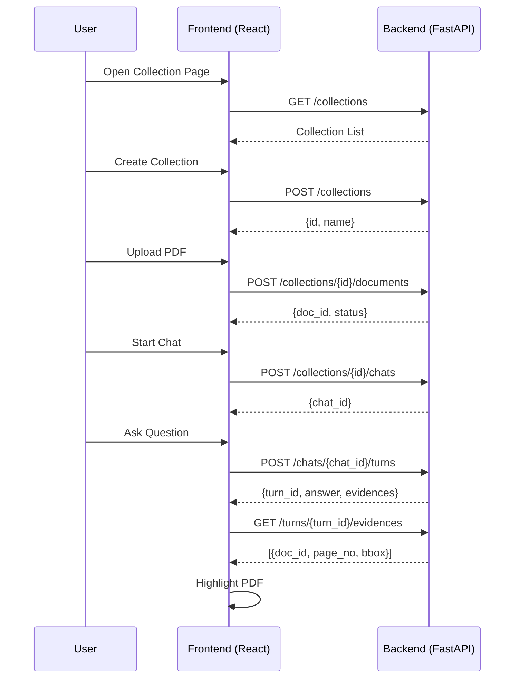

# Macro Interaction Logic Design

## 🧩 System Interaction Hierarchy

| Level | Entity Object   | State / Behavior                                        | Description                          |
| ----- | --------------- | ------------------------------------------------------- | ------------------------------------ |
| L1    | `Collection`    | Container managing multiple documents and chat sessions | Maps to DB table `collections`       |
| L2    | `Document`      | PDF document belonging to a Collection                  | Maps to table `documents`            |
| L3    | `Chat`          | Multi-turn Q&A session under a Collection               | Maps to table `chats`                |
| L4    | `Turn`          | A single Q&A exchange within a Chat                     | Maps to table `turns`                |
| L5    | `Turn2Evidence` | Evidence anchors cited in the QA result                 | Maps to bridge table `turn2evidence` |

---

## 🧭 Full Frontend–Backend Interaction Flow

### 🩵 1. Collection Management Phase

| Step | Frontend Action (UI Event)                   | Request                                           | Backend Response                                      | Frontend Update                              |                              |
| ---- | -------------------------------------------- | ------------------------------------------------- | ----------------------------------------------------- | -------------------------------------------- | ---------------------------- |
| 1.1  | On page load, request collection list        | `GET /collections`                                | `{ data: [ {id, name, doc_count, created_at}, ...] }` | Render collection list                       |                              |
| 1.2  | User clicks “New Collection” and inputs name | `POST /collections` with `{ name, description? }` | `{ data: {id, name, created_at} }`                    | Append new collection to frontend state      |                              |
| 1.3  | User clicks delete button                    | `DELETE /collections/{id}`                        | `{ meta: {deleted: true} }`                           | Remove collection item from UI               |                              |
| 1.4  | User clicks to enter a collection            | Navigate and load collection detail page          | `GET /collections/{id}`                               | `{ data: {id, name, documents[], chats[]} }` | Set `activeCollection` state |

---

### 🩷 2. Document Upload & Management Phase

| Step | Frontend Action                                  | Request                                                  | Response                                         | State Update                                       |
| ---- | ------------------------------------------------ | -------------------------------------------------------- | ------------------------------------------------ | -------------------------------------------------- |
| 2.1  | User clicks “Upload Document” and selects PDF    | `POST /collections/{id}/documents` (multipart/form-data) | `{ data: { doc_id, file_name, upload_status } }` | Refresh collection’s document list                 |
| 2.2  | Backend performs parsing/indexing asynchronously | (polling) `GET /documents/{doc_id}/status`               | `{ data: { parse_status, index_status } }`       | Update document status label (“parsed / indexing”) |
| 2.3  | Frontend displays PDF                            | `GET /documents/{doc_id}/file`                           | Returns PDF binary or URL                        | Cache and render in PDF Viewer                     |

---

### 💬 3. Chat Initialization & Multi-turn QA Phase

| Step | Frontend Action                                     | Request                                                          | Response                                             | Frontend Processing                           |
| ---- | --------------------------------------------------- | ---------------------------------------------------------------- | ---------------------------------------------------- | --------------------------------------------- |
| 3.1  | User clicks “New Chat”                              | `POST /collections/{id}/chats`                                   | `{ data: { chat_id, name: "Chat #1" } }`             | Set `activeChat` and navigate to QA workspace |
| 3.2  | Frontend renders dropdown of PDFs in the Collection | `GET /collections/{id}/documents`                                | `{ data: [{doc_id, name, num_pages}] }`              | Populate dropdown options                     |
| 3.3  | User types a question and clicks send               | `POST /chats/{chat_id}/turns` with `{ question, selected_doc? }` | `{ data: { turn_id, question, answer, anchors[] } }` | Append Q&A item to chat UI                    |
| 3.4  | Answer contains `[Evidence#3]` anchor               | Frontend renders as clickable hyperlink                          | —                                                    | Clicking triggers jump logic (see below)      |

---

### 📎 4. Evidence Anchor Jump Phase

| Frontend Action            | Request                          | Response                                         | Frontend Behavior                                         |
| -------------------------- | -------------------------------- | ------------------------------------------------ | --------------------------------------------------------- |
| User clicks `[Evidence#3]` | `GET /turns/{turn_id}/evidences` | `{ data: [{ doc_id, page_no, bbox, snippet }] }` | PDF Viewer jumps to target page and highlights the region |

> ⚙️ **Note:** Backend may directly include an `anchors` array in the answer (as `turn.evidences`), eliminating the need for a separate fetch.

---

### 🧡 5. Historical Chat Management Phase

| Step | Frontend Action                          | Request                                  | Response                                                                      | State Change              |
| ---- | ---------------------------------------- | ---------------------------------------- | ----------------------------------------------------------------------------- | ------------------------- |
| 5.1  | User deletes a chat from collection page | `DELETE /chats/{chat_id}`                | `{ meta: {deleted: true} }`                                                   | Refresh chat list         |
| 5.2  | User opens a historical chat             | `GET /chats/{chat_id}`                   | `{ data: {chat_id, name, turns:[{turn_id, question, answer, evidences[]}]} }` | Load full chat history    |
| 5.3  | User renames a chat                      | `PATCH /chats/{chat_id}` with `{ name }` | `{ data: {chat_id, name} }`                                                   | Update chat title display |

---

## 🧠 Key Frontend States (React Hooks)

| State Name         | Type                                         | Source                        | Description                          |
| ------------------ | -------------------------------------------- | ----------------------------- | ------------------------------------ |
| `activeCollection` | `{id, name}`                                 | URL or user selection         | Current workspace                    |
| `documents`        | `[ {id, name, status} ]`                     | `/collections/{id}/documents` | Uploaded PDF list                    |
| `activeChat`       | `{id, name}`                                 | `/collections/{id}/chats`     | Current chat session                 |
| `turns`            | `[ {id, q, a, evidences[]} ]`                | `/chats/{chat_id}/turns`      | Q&A history of current chat          |
| `highlightContext` | `{doc_id, page_no, bbox}`                    | `/turns/{turn_id}/evidences`  | Context driving PDF Viewer highlight |
| `pdfCache`         | `{ doc_id → {url, num_pages, lastFetched} }` | `/documents/{doc_id}/file`    | Cached PDF map                       |

---

## 🧩 Unified Response Envelope (Recommended)

Backend (FastAPI) returns responses in a consistent format:

```json
{
  "data": {...}, 
  "meta": {"timestamp": "2025-11-01T12:00:00Z"}, 
  "error": null
}
```

---

## 🔄 Simplified Visualization Sequence Diagram


