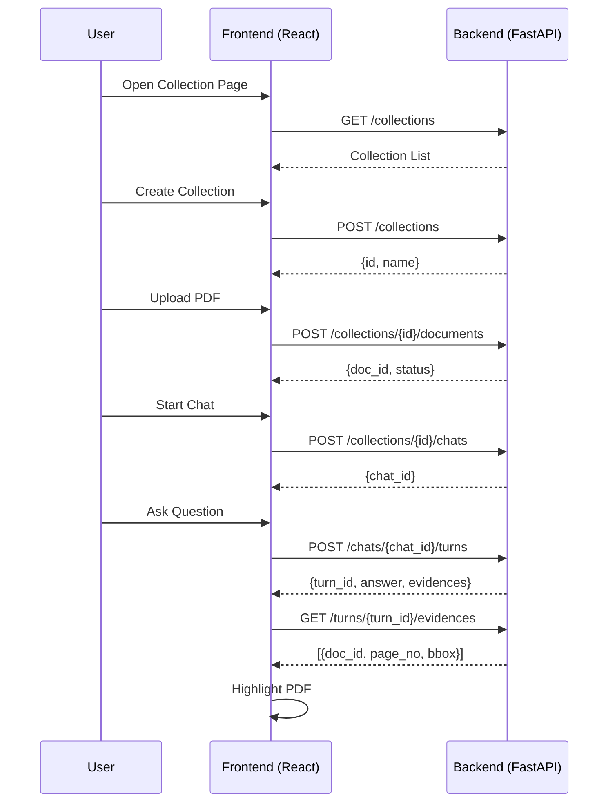

# 宏观交互逻辑设计

## 🧩 系统交互层次结构（Interaction Hierarchy）

| 层级 | 实体对象            | 状态 / 行为               | 说明                    |
| -- | --------------- | --------------------- | --------------------- |
| L1 | `Collection`    | 管理多个文档与Chat会话的容器      | 对应数据库表 `collections`  |
| L2 | `Document`      | 属于某个Collection的PDF文档  | 对应表 `documents`       |
| L3 | `Chat`          | 属于某个Collection的多轮问答会话 | 对应表 `chats`           |
| L4 | `Turn`          | Chat中的单轮问答记录          | 对应表 `turns`           |
| L5 | `Turn2Evidence` | 问答结果中引用的证据锚点          | 对应桥接表 `turn2evidence` |

---

## 🧭 用户前后端交互全流程（Front–Backend Interaction Flow）

### 🩵 1. Collection 管理阶段

| 步骤  | 前端动作 (UI Event)            | 发送请求                                              | 后端响应                                                  | 前端更新                                         |                               |
| --- | -------------------------- | ------------------------------------------------- | ----------------------------------------------------- | -------------------------------------------- | ----------------------------- |
| 1.1 | 页面加载时请求collection列表        | `GET /collections`                                | `{ data: [ {id, name, doc_count, created_at}, ...] }` | 渲染collection列表                               |                               |
| 1.2 | 用户点击“新建 Collection”按钮并输入名称 | `POST /collections` with `{ name, description? }` | `{ data: {id, name, created_at} }`                    | 在前端state中追加新collection                       |                               |
| 1.3 | 用户点击删除按钮                   | `DELETE /collections/{id}`                        | `{ meta: {deleted: true} }`                           | 从UI中移除该collection项                           |                               |
| 1.4 | 用户点击进入某个collection         | 跳转并加载collection详情页                                | `GET /collections/{id}`                               | `{ data: {id, name, documents[], chats[]} }` | 前端设置 `activeCollection` state |

---

### 🩷 2. Document 上传与管理阶段

| 步骤  | 前端动作             | 请求                                                       | 响应                                               | 状态更新                    |
| --- | ---------------- | -------------------------------------------------------- | ------------------------------------------------ | ----------------------- |
| 2.1 | 用户点击“上传文档”，选择PDF | `POST /collections/{id}/documents` (multipart/form-data) | `{ data: { doc_id, file_name, upload_status } }` | 刷新collection的document列表 |
| 2.2 | 文档解析/索引后台异步进行    | （可轮询）`GET /documents/{doc_id}/status`                    | `{ data: { parse_status, index_status } }`       | 更新文档状态标签（已解析 / 索引中）     |
| 2.3 | 前端需要展示PDF        | `GET /documents/{doc_id}/file`                           | 返回PDF二进制流或URL                                    | 前端PDF Viewer缓存并展示       |

---

### 💬 3. Chat 启动与多轮问答阶段

| 步骤  | 前端动作                            | 请求                                                               | 响应                                                   | 前端处理                     |
| --- | ------------------------------- | ---------------------------------------------------------------- | ---------------------------------------------------- | ------------------------ |
| 3.1 | 用户点击“新建 Chat”                   | `POST /collections/{id}/chats`                                   | `{ data: { chat_id, name: "Chat #1" } }`             | 设置 `activeChat` 并跳转到QA页面 |
| 3.2 | 前端渲染下拉框展示该Collection内的PDF       | `GET /collections/{id}/documents`                                | `{ data: [{doc_id, name, num_pages}] }`              | 填充选择框选项                  |
| 3.3 | 用户在输入框输入问题并点击发送                 | `POST /chats/{chat_id}/turns` with `{ question, selected_doc? }` | `{ data: { turn_id, question, answer, anchors[] } }` | 在聊天框中追加问答                |
| 3.4 | 答案中带Evidence锚点，如 `[Evidence#3]` | 前端渲染为可点击的超链接                                                     | —                                                    | 点击时触发跳转逻辑（见下）            |

---

### 📎 4. Evidence 锚点跳转阶段

| 前端动作                | 请求                               | 响应                                               | 前端行为                       |
| ------------------- | -------------------------------- | ------------------------------------------------ | -------------------------- |
| 用户点击 `[Evidence#3]` | `GET /turns/{turn_id}/evidences` | `{ data: [{ doc_id, page_no, bbox, snippet }] }` | 前端调用PDF Viewer跳转到对应页并高亮该区域 |

> ⚙️ **注意**：后端在返回answer时，可直接附带 `anchors` 数组（简化为 `turn.evidences`），前端无需再次请求详情。

---

### 🧡 5. 历史 Chat 管理阶段

| 步骤  | 前端动作                    | 请求                                       | 响应                                                                            | 状态变化         |
| --- | ----------------------- | ---------------------------------------- | ----------------------------------------------------------------------------- | ------------ |
| 5.1 | 用户在collection页面点击删除chat | `DELETE /chats/{chat_id}`                | `{ meta: {deleted: true} }`                                                   | 刷新chat列表     |
| 5.2 | 用户点击打开历史chat            | `GET /chats/{chat_id}`                   | `{ data: {chat_id, name, turns:[{turn_id, question, answer, evidences[]}]} }` | 加载完整对话历史     |
| 5.3 | 用户修改chat名称              | `PATCH /chats/{chat_id}` with `{ name }` | `{ data: {chat_id, name} }`                                                   | 更新当前chat标题显示 |

---

## 🧠 前端关键状态（React Hooks）

| 状态名                | 类型                                           | 来源                            | 说明                   |
| ------------------ | -------------------------------------------- | ----------------------------- | -------------------- |
| `activeCollection` | `{id, name}`                                 | URL或点击选择                      | 当前工作空间               |
| `documents`        | `[ {id, name, status} ]`                     | `/collections/{id}/documents` | 已上传的PDF列表            |
| `activeChat`       | `{id, name}`                                 | `/collections/{id}/chats`     | 当前对话会话               |
| `turns`            | `[ {id, q, a, evidences[]} ]`                | `/chats/{chat_id}/turns`      | 当前chat的问答历史          |
| `highlightContext` | `{doc_id, page_no, bbox}`                    | `/turns/{turn_id}/evidences`  | 驱动PDF Viewer渲染的锚点上下文 |
| `pdfCache`         | `{ doc_id → {url, num_pages, lastFetched} }` | `/documents/{doc_id}/file`    | PDF缓存映射              |

---

## 🧩 请求封装统一格式（建议）

后端FastAPI统一返回：

```json
{
  "data": {...}, 
  "meta": {"timestamp": "2025-11-01T12:00:00Z"}, 
  "error": null
}
```

---

## 🔄 可视化顺序图（简化版）



---


