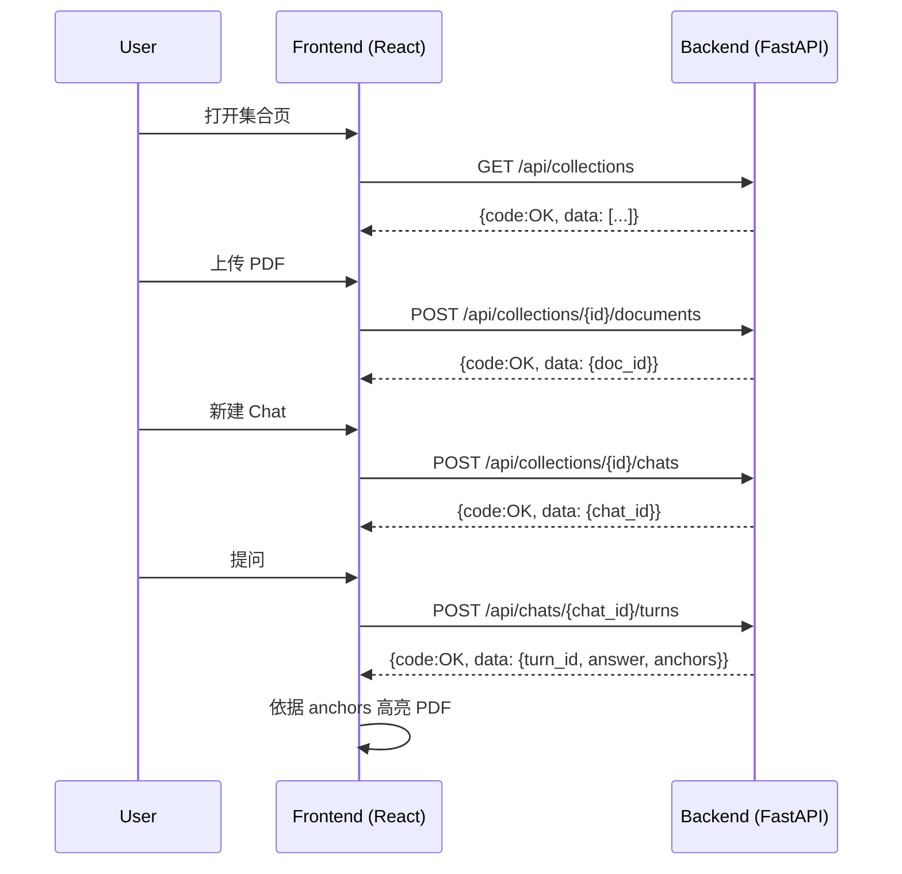

# 📘 PaperQA 系统设计文档（精简统一版）

本设计文档是系统的单一权威来源，仅维护中文版本；文档合并与修复遵循 M3 一致性与修复指引：
- API 统一以 `/api` 为前缀（健康检查 `GET /healthz` 例外）；
- 响应 envelope 统一：成功 `{"code":"OK","data":...}`，错误 `{"code":"SOME_ERROR","message":"..."}`；
- Evidence 编号在同一 chat 内连续递增；
- 元素结构统一使用 `text_content`、`text_caption` 与 `image_base64`；
- 端到端流程采用同步、无后台队列设计。

## 一、架构蓝图（极简原型）

```mermaid
graph TD
    subgraph 客户端
        A[React 前端]
    end
    subgraph 后端
        B1[API Router (/api)]
        B2[Control Service]
        B3[Retrieval Service]
        B4[Memory Service]
        B5[Answer Service]
    end
    subgraph 外部
        C1[MinerU 解析 API]
        C2[OceanBase 存储]
        C3[DSPy + 本地 Ollama LLMs]
    end

    A -->|上传 PDF| B1 -->|转发文件| B2
    B2 -->|调用解析| C1 -->|content_list + md_text| B2
    B2 -->|写 documents/elements| C2
    A -->|提问| B1 --> B2
    B2 -->|问句重写| C3
    B2 -->|检索候选| B3 -->|向量+元数据| C2
    B3 -->|去重与缓存| B4 -->|evidence 上下文| B5
    B5 -->|多模态提示| C3 -->|带 [Evidence#no] 的答案| B5
    B5 -->|写 turn 与证据映射| C2
    B5 -->|返回| B1 -->|answer + anchors| A
```

### 组件职责

| 层次 | 组件 | 职责 |
| --- | --- | --- |
| 前端 | React 页面与组件 | 上传、聊天、PDF 高亮；所有请求直连 FastAPI，薄封装 `fetch`。 |
| 后端 API | `api` 路由 + Pydantic `schemas` | 暴露上传、建 Chat、问答等 HTTP 入口；序列化 `[Evidence#no]`、`bbox`、`page_no`。 |
| 服务层 | `preprocess`、`index`、`retrieval`、`memory`、`llm`、`qa_flow`、`integrations` | 同步函数、可组合；`integrations` 封装 MinerU、OceanBase、DSPy/LLM。 |
| 仓储层 | OceanBase 表网关 | 直接 SQL 的 CRUD，表：`collections/documents/elements/chats/turns/turn2evidence`。 |
| 外部系统 | MinerU、OceanBase、DSPy/LLM | 后端以阻塞调用方式访问，显式错误处理与少量重试。 |

## 二、数据与控制流程总结

1. 上传：前端上传 PDF，后端保存元信息，调用 MinerU，标准化 `content_list`，写入 `documents/elements`。
2. 索引：生成向量嵌入（Jina Embeddings v4，经本地 vLLM），写入 `elements.vec_embedding`（维度由 `VECTOR_DIM` 配置）。
3. 提问：DSPy 调用本地 Ollama 做问句重写；检索服务做向量与元数据查找，记忆服务确保 Evidence 编号连续。
4. 回答：构造多模态提示，生成带 `[Evidence#no]` 的答案；写入 `turns` 与 `turn2evidence`，前端用 `bbox/page_no` 高亮。

## 三、统一元素结构

- 纯文本：`text_content = header_name + level_nav + text_content`
- 标题：`text_content = header_name + level_nav + section_summary`
- 图像/表格：`text_content = header_name + level_nav + text_caption`；图像内容放 `image_base64`
- 公式：`text_content = header_name + level_nav + equation_text (LaTeX)`

说明：统一采用字段 `image_base64`（图像 base64 内容）与 `text_caption`（图/表说明），与数据模型保持一致。

## 四、前后端交互（合并整理）

交互层次结构：

| 层级 | 实体对象 | 状态/行为 | 说明 |
| -- | -- | -- | -- |
| L1 | `Collection` | 管理多个文档与 Chat 的容器 | 表 `collections` |
| L2 | `Document` | 属于某 Collection 的 PDF | 表 `documents` |
| L3 | `Chat` | 属于某 Collection 的多轮会话 | 表 `chats` |
| L4 | `Turn` | Chat 中的单轮问答 | 表 `turns` |
| L5 | `Turn2Evidence` | 结果中引用的证据锚点 | 桥表 `turn2evidence` |

关键 API（统一 `/api` 前缀，`/healthz` 例外）：
- `GET /api/collections`, `POST /api/collections`, `DELETE /api/collections/{id}`
- `POST /api/collections/{id}/documents`, `GET /api/documents/{doc_id}/file`
- `POST /api/collections/{id}/chats`, `GET /api/chats/{chat_id}`
- `POST /api/chats/{chat_id}/turns`, `GET /api/turns/{turn_id}/evidences`
- 健康检查：`GET /healthz`

响应 envelope：
- 成功：`{"code":"OK","data":{...}}`
- 失败：`{"code":"SOME_ERROR","message":"..."}`

顺序图（同步流程，无轮询）：



## 五、Evidence 编号策略

- 在同一 chat 内从 1 开始连续递增，不在每个 turn 重置。
- 桥表主键：`(chat_id, evidence_no)`；保留 `turn_id` 与 `turn_order` 便于查询。

## 六、配置与环境

- `VECTOR_DIM`：控制 `elements.vec_embedding` 的向量维度。
- 模型与执行：本地 Ollama（文本：`llama3:70b`，多模态：`qwen2.5vl:72b`）；编排采用 DSPy（包名 `dspy`）。
