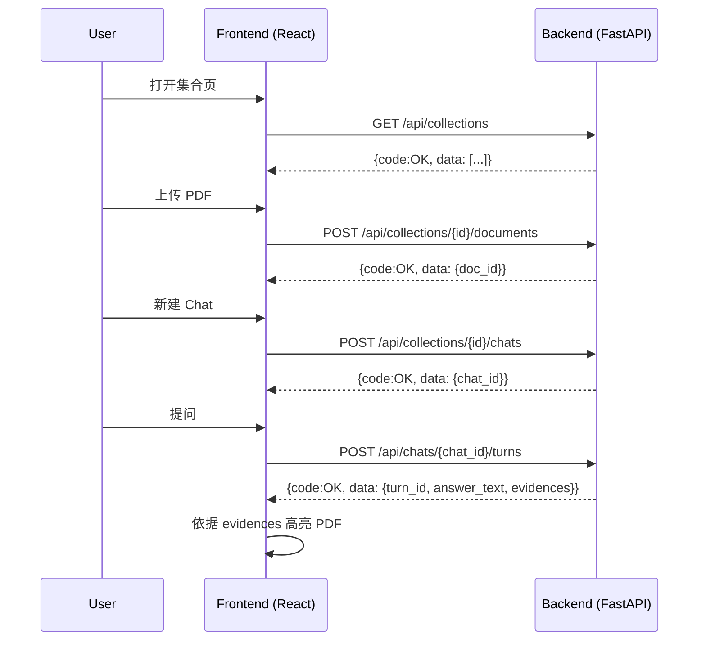

# 📘 PaperQA 系统设计文档（精简统一版）

本设计文档是系统的单一权威来源，仅维护中文版本；文档合并与修复遵循 M3 一致性与修复指引：
- API 统一以 `/api` 为前缀（健康检查 `GET /healthz` 例外）；
- 响应 envelope 统一：成功 `{"code":"OK","data":...}`，错误 `{"code":"SOME_ERROR","message":"..."}`；
- Evidence 展示编号在同一 chat 内连续递增（由后端动态生成，内部不持久化存储evidence_no到数据库）；
- 元素结构统一使用 `text_content`、`text_caption` 与 `image_base64`；
- 端到端流程采用同步、无后台队列设计。

## 一、架构蓝图（极简原型）

```mermaid
graph TD
    subgraph 客户端
        A[React 前端]
    end
    subgraph 后端
        B1[API Router (/api)]
        B2[Control Service]
        B3[Retrieval Service]
        B4[Memory Service]
        B5[Answer Service]
    end
    subgraph 外部
        C1[MinerU 解析 API]
        C2[OceanBase 存储]
        C3[DSPy（仅文本任务）]
        C4[视觉问答接口（OpenAI 兼容）]
    end

    A -->|上传 PDF| B1 -->|转发文件| B2
    B2 -->|调用解析| C1 -->|content_list + md_text| B2
    B2 -->|写 documents/elements| C2
    A -->|提问| B1 --> B2
    B2 -->|问句重写| C3
    B2 -->|检索候选| B3 -->|向量+元数据| C2
    B3 -->|去重与缓存| B4 -->|evidence 上下文| B5
    B5 -->|文本提示| C3 -->|初步答案/需要补充图像理解?| B5
    B5 -->|可选：图像VQA| C4 -->|图像摘要文本| B5
    B5 -->|合并文本上下文| C3 -->|带 [Elem#id] 的答案| B5
    B5 -->|写 turn 与元素映射| C2
    B5 -->|返回| B1 -->|answer_text([Elem#id]) + evidences| A
```

### 组件职责

| 层次 | 组件 | 职责 |
| --- | --- | --- |
| 前端 | React 页面与组件 | 上传、聊天、PDF 高亮；所有请求直连 FastAPI，薄封装 `fetch`。 |
| 后端 API | `api` 路由 + Pydantic `schemas` | 暴露上传、建 Chat、问答等 HTTP 入口；内部与 `answer_text` 字段统一使用 `[Elem#id]`，并在响应中附带 `evidences` 列表（至少含 `element_id/evidence_no/doc_id/page_no/elem_type/bbox/level_nav/evidence_title`），供前端按 Evidence 渲染规范展示。 |
| 服务层 | `preprocess`、`index`、`retrieval`、`memory`、`llm`、`qa_flow`、`integrations` | 同步函数、可组合；`integrations` 封装 MinerU、OceanBase、DSPy/LLM。 |
| 仓储层 | OceanBase 表网关 | 直接 SQL 的 CRUD，表：`collections/documents/elements/chats/turns/turn2element`。 |
| 外部系统 | MinerU、OceanBase、DSPy/LLM | 后端以阻塞调用方式访问，显式错误处理与少量重试。 |

## 二、数据与控制流程总结

1. 上传：前端上传 PDF，后端保存元信息，调用 MinerU，标准化 `content_list`，写入 `documents/elements`；其中 `documents.title` 优先采用解析结果中首个 header 元素的标题文本，若不存在有效 header 则回退为文件名。遇到标题为 “Abstract” 的元素时，将其后第一个正文元素作为摘要写入 `documents.abstract`，同时预留 `meta_info` JSON 存放后续扩展元数据。
2. 索引：生成向量嵌入（Jina Embeddings v4，经本地 vLLM），写入 `elements.vec_embedding`（维度由 `VECTOR_DIM` 配置）。
3. 提问：使用 DSPy 进行文本问句重写；检索服务做向量与元数据查找；Evidence 展示编号由 API 层在返回前按 chat 维度动态生成 `element_id → evidence_no` 映射，并通过 `evidences` 列表返回（每条 evidence 携带 `doc_id/page_no/elem_type/bbox/level_nav/evidence_title` 等元数据）。
4. 回答：默认仅使用文本上下文（图像元素以 caption 参与）。可选“图像理解”路径：对检索到的 image 元素按 question+query 派生子问题，调用独立的视觉问答接口获取摘要文本，与 caption 合并为文本上下文，再由 DSPy 文本回答模块生成带 `[Elem#<element_id>]` 的答案；完成后写入 `turns` 与 `turn2element`，并在 API 中附带 `evidences` 列表；前端按 Evidence 渲染规范将 `answer_text` 中的 `[Elem#id]` 渲染为用户可见的 `[Evidence#no]`，并用 `bbox/page_no` 高亮 PDF。

## 三、统一元素结构

- 公共前缀：所有元素的 `text_content` 均以 `[doc_title] [page_no] [level_nav]` 作为前缀，用于标记归属文档、页码与章节路径。
- 纯文本（`elem_type="text"`）：前缀后拼接当前段落的 `raw_text_content`，并按 `ELEMENT_CONTEXT_OVERLAP` 配置在同一 `level_nav` 内追加前后若干元素的 `raw_text_content` 作为上下文。
- 标题（`elem_type="header"`）：前缀后使用 `section_summary` 作为主体文本，同样可以按 overlap 规则追加同一章节内的上下文。
- 图像（`elem_type="image"`）：前缀后保留图片 caption（`text_caption`），**不再拼接 overlap 上下文**（MinerU caption 已可自包含）；图像像素内容存入 `image_base64`。
- 表格（`elem_type="table"`）：前缀后保留表格 caption + markdown 形式的表格正文（来自 MinerU），**不再拼接 overlap 上下文**；caption 仍保留在 `text_caption` 字段。
- 公式（`elem_type="equation"`）：`text_content` 使用公式原始 LaTeX 文本（来自 `raw_text_content`）及同一 section 内上下文。

说明：统一采用字段 `image_base64`（图像 base64 内容）与 `text_caption`（图/表说明），`raw_text_content` 保留 MinerU 原始解析文本，`text_content` 用于向量检索与回答上下文，二者与数据模型保持一致。

## 四、前后端交互（合并整理）

交互层次结构：

| 层级 | 实体对象 | 状态/行为 | 说明 |
| -- | -- | -- | -- |
| L1 | `Collection` | 管理多个文档与 Chat 的容器 | 表 `collections` |
| L2 | `Document` | 属于某 Collection 的 PDF | 表 `documents` |
| L3 | `Chat` | 属于某 Collection 的多轮会话 | 表 `chats` |
| L4 | `Turn` | Chat 中的单轮问答 | 表 `turns` |
| L5 | `Turn2Element` | 结果中引用的元素映射 | 桥表 `turn2element` |

关键 API（统一 `/api` 前缀，`/healthz` 例外）：
- `GET /api/collections`, `POST /api/collections`, `DELETE /api/collections/{id}`
- `POST /api/collections/{id}/documents`, `GET /api/documents/{doc_id}/file`
- `POST /api/collections/{id}/chats`, `GET /api/chats/{chat_id}`
- `POST /api/chats/{chat_id}/turns`, `GET /api/turns/{turn_id}/evidences`
- 健康检查：`GET /healthz`

响应 envelope：
- 成功：`{"code":"OK","data":{...}}`
- 失败：`{"code":"SOME_ERROR","message":"..."}`

顺序图（同步流程，无轮询）：



## 五、Evidence 编号策略（M4 更新）

- LLM/服务层统一使用锚点 `[Elem#<element_id>]`。
- 在同一 chat 维度，按元素“首次出现顺序”动态生成展示编号 `evidence_no`，从 1 开始、跨 turn 累积；不持久化存库，仅通过 API 响应中的 `evidences` 列表对前端暴露。
- 桥表更名为 `turn2element`，主键：`(chat_id, turn_id, element_id)`；保留 `turn_order` 便于查询，且仅为回答文本中真实出现的 `[Elem#id]` 写入记录。

## 六、DSPy 与图像处理策略

已验证限制：当前 `dspy.Signature` 无法稳定携带图像（路径/base64/URL），一旦携带会导致与图片内容无关的回答；直接调用 OpenAI 视觉接口则可得到正确结果。因此本系统采用如下策略：

- DSPy 仅承担“文本任务”：问句重写、文本型回答生成与锚点输出；DSPy 内部签名仅接受 `element_id / elem_type / text_content`。
- 默认路径：回答仅基于文本上下文；若元素为 image/table/equation，仅使用其 `text_caption` 作为参与检索与回答的 `text_content`。
- 可选图像理解路径：
  - 过滤出被检索命中的 `image` 类型元素；
  - 基于原始 `question` 与检索相关的 `context` 生成 1 个针对该图片的派生子问题（文本）；
  - 通过后端的独立集成模块按 `element_id` 从数据库取回该元素的 `image_base64`；
  - 调用 OpenAI 兼容的视觉问答接口得到该图片的“摘要性文字答案”；
  - 将“摘要性文字答案”与该图片的 `text_caption` 拼接为新的 `text_content`，并作为文本上下文提供给 DSPy 文本回答模块；
  - 整个视觉问答流程不进入 DSPy 内部，仅以“文本化结果”回注。

后端建议增加集成函数原型（仅示意）：

```
def vision_vqa_summarize(element_id: int, derived_question: str) -> str:
    """从 DB 读取 image_base64，调用视觉问答接口（OpenAI 兼容），返回文字摘要。"""
```

## 七、配置与环境

- `VECTOR_DIM`：控制 `elements.vec_embedding` 的向量维度。
- `ELEMENT_CONTEXT_OVERLAP`：控制在构造 `text_content` 时，同一 `level_nav` 内向前/向后拼接的元素个数（默认 1，0 表示仅保留当前元素文本、不做 overlap）。
- 模型与执行：文本模型用于 DSPy（如 `llama3:70b`）；视觉问答通过独立的 OpenAI 兼容接口完成；编排采用 DSPy（包名 `dspy`，仅文本签名）。
